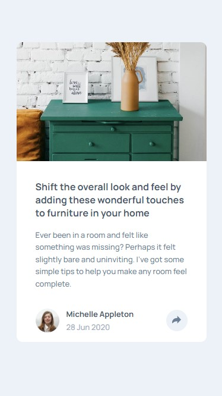
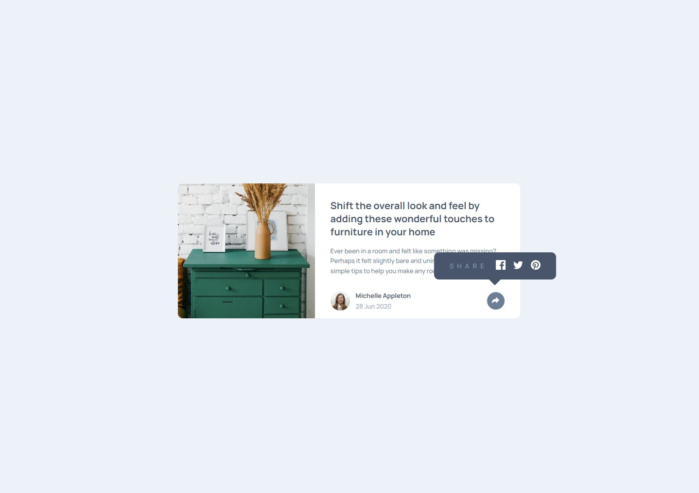

# Article preview component solution

This is a solution to the [Article preview component challenge on Frontend Mentor](https://www.frontendmentor.io/challenges/article-preview-component-dYBN_pYFT).

## Table of contents

- [Overview](#overview)
  - [The challenge](#the-challenge)
  - [Screenshot](#screenshot)
  - [Links](#links)
- [My process](#my-process)
  - [Built with](#built-with)
  - [What I learned](#what-i-learned)
- [Author](#author)

## Overview

### The challenge

Users should be able to:

- View the optimal layout for the component depending on their device's screen size
- See the social media share links when they click the share icon

### Screenshot

#### Mobile design

#### Desktop design

### Links

- Solution URL: [Code](https://github.com/hellcsaba/article-preview-component)
- Live Site URL: [Article preview component live](https://hellcsaba.github.io/article-preview-component/)

## My process

### Built with

- Semantic HTML5 markup
- CSS custom properties
- Flexbox
- Mobile-first workflow
- JavaScript
- BEM notation

### What I learned

I learnt how to show properly the share function based on the device (mobile or desktop).

## Author

- Website - [Csaba Hell](https://github.com/hellcsaba)
- Frontend Mentor - [@hellcsaba](https://www.frontendmentor.io/profile/hellcsaba)
- LinkedIn - [@csabahell](https://www.linkedin.com/in/csabahell/)
